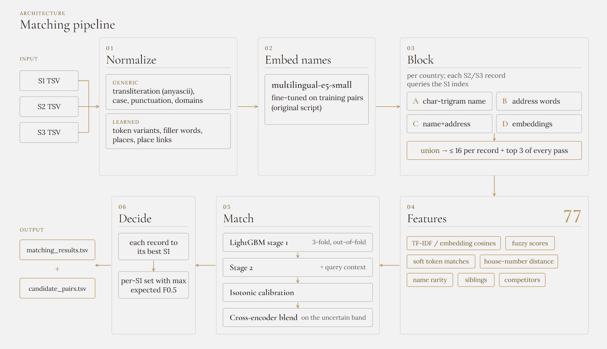
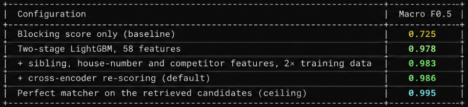

# Amazon ML Challenge 2026 : Business entity resolution

<p align="center">
  
</p>

<h1 align="center">Entity Resolver</h1>

<p align="center">
Finds businesses that appear in multiple, messy data sources and links them together as the same business. Handles typos, abbreviations, missing details, and names written in different languages, while telling true matches apart from similar but different businesses. 
Built to be highly accurate, correctly matching the vast majority of businesses.
</p>

<p align="center">
  
  
  
  
  
  
  
  
  
  
  
  
  
  
  
</p>

## How it works



Details: [docs/methodology.md](docs/methodology.md). How the model got here, step by step:
[docs/development-log.md](docs/development-log.md).

## Results

Validation: 5% of training S1 businesses are held out; half tunes calibration and thresholds,
the other half (55,357 businesses) is only used for reporting. Retrieval runs over the full
training data, so the held-out businesses face the full crowd of distractors.



By country: US 0.989, India 0.982. Businesses with no match at all: 0.991. Leave-one-country-out
(train on one country, evaluate on the other): 0.934 and 0.976, the price of an unseen country.

These numbers come from held-out data of the same distribution as training. Data with a different
noise or distractor profile will score lower, and the decision threshold is the first thing to
re-tune there.

## Highlights

| Feature | Description |
|---|---|
| **Flipped search direction** | Each S2/S3 record is a query that can belong to at most one S1 business, so conflicting merges are impossible by construction. |
| **Four retrieval passes** | Keeps 98.5% of true pairs at ~19 candidates per record: character trigrams of the name, address words, name + address words, and nearest neighbours in a multilingual embedding space. |
| **No hand-written language knowledge** | Abbreviations, spelling variants and legal forms are mined from training matches; filler words, places and place links (city ↔ region) come from each dataset's own statistics. |
| **Evidence from related records** | Compares each record with the business's other confidently matched records ("siblings") and with competing businesses of the same name, separating house-number noise from a genuinely different business. |
| **Two-stage LightGBM + cross-encoder** | 77 pair features, 30M training pairs, a second stage that sees each query's competing candidates, and a fine-tuned multilingual cross-encoder for the uncertain band. |
| **Decision layer built for F0.5** | Precision counts double, so the output set per business maximizes expected F0.5 rather than using a fixed cut-off — every optional step is tuned together and kept only if it measurably helps. |

## Quick start (synthetic data, about a minute)

```bash
python -m venv venv && source venv/bin/activate
pip install -e .                     # core pipeline (add ".[embed]" for embeddings + cross-encoder)
python scripts/make_synthetic.py --out data_synthetic
python scripts/train.py --data-dir data_synthetic --work-dir work_synthetic --no-embed --jobs 2
python scripts/test.py  --data-dir data_synthetic --work-dir work_synthetic --output-dir output_synthetic
```

On macOS, LightGBM also needs the OpenMP runtime: `brew install libomp`.

## Full run

1. Download the dataset from the
   [dataset download page](https://shanmugaramana.github.io/Entity-Resolver/dataset.html) and unzip
   it in the repository root. This creates `dataset/`, laid out as described in
   [dataset/README.md](dataset/README.md).
2. Install everything, including the embedding extras:
   `pip install -e ".[embed]"`, or `pip install -r requirements.txt` for the exact versions used.
3. Train and predict:
   ```bash
   python scripts/train.py      # artifacts + training report in work/model/
   python scripts/test.py       # output/matching_results.tsv and output/candidate_pairs.tsv
   python scripts/score.py --pred work/model/val_matching_results.tsv \
                           --truth work/model/val_ground_truth.tsv      # independent re-check
   ```
   Add `--sample 0.05` to either script for a consistent 5% subset (minutes instead of hours).

Every stage is cached in `work/` with its own key, so an interrupted run resumes, and a settings
change recomputes only the stages it affects.

**Run time** on a MacBook Pro (M4 Pro, 12 cores, 24 GB): training about 3 h, prediction about
2.8 h, peak memory about 20 GB. The first run also downloads the 470 MB encoder.

**Main options** (`scripts/train.py`): `--no-embed` (no torch needed), `--no-finetune`,
`--no-cross-encoder`, `--no-consistency`, `--proxy` (leave-one-country-out report),
`--sim-drop F` (simulate a denser crowd), `--jobs N`, `--force`.

## Tests

```bash
pip install -r requirements-dev.txt
pytest -m "not e2e"     # unit tests (seconds)
ruff check src scripts tests
```

CI runs both on every push. Run `pytest -m e2e` by hand after pipeline changes (trains a small
model on synthetic data, about a minute) — it's not part of CI.

## License

MIT, see [LICENSE](LICENSE). The pretrained encoder `intfloat/multilingual-e5-small` is MIT
licensed; all Python dependencies are MIT, BSD, Apache-2.0 or ISC, except `certifi` (MPL-2.0),
which is only used to download the encoder.
